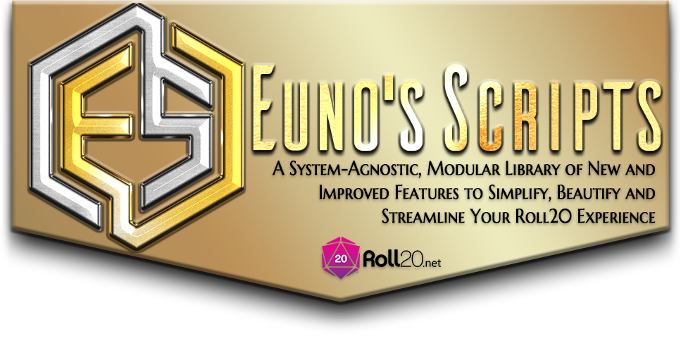
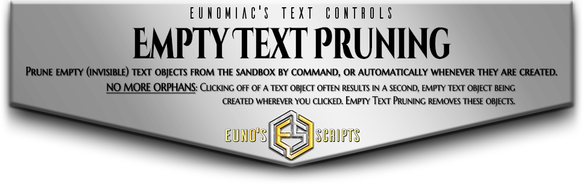
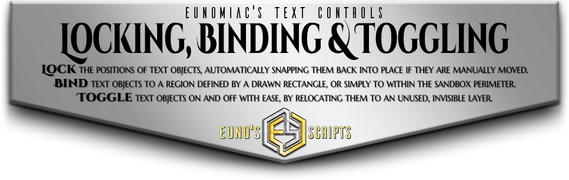

I've written a ton of scripts in my neverending quest to transform the Roll20 sandbox into a more interactive, more feature-packed virtual tabletop. I haven't seen many implementations of these features elsewhere, so I decided to finally take the time to untangle my interdependent web of scripts and prepare them for contribution to the Roll20 community at large.  I'll be grouping these into packages by theme, the first of which to be released (in very early alpha) being **!ETC: Eunomiac's Text Controls**.

Roll20's native support for Text Objects (i.e. text you create directly in the sandbox) is limited, especially if you'd like to make your sandbox into an infographic or HUD. Enter **!ETC** to provide a host of functions dedicated to streamlining, simplifying and automating your ability to use Text Objects for all manner of applications!

# Installation & Setup
* **Download Latest Release** — Download the latest release at :link:[this link](https://github.com/Eunomiac/EunosRoll20Scripts/releases).
* **Install EunoScript Dependencies** — If you haven't already: 
    * **Install `EunoCONFIG.js`** — Install the contents of **`EunoCONFIG.js`** as a new script in the "API Scripts" section of your game management page.
    * **Install `EunoLIB.js`** — Install the contents of **`EunoLIB.js`** in the same way, as a new script *after* **`EunoCONFIG.js`**.
* **Install EunoScript Modules** — Install any or all of the modular scripts provided in the release, ensuring the above dependencies are located before them on your "API Scripts" page.
    * **`ETC.js`** — **Eunomiac's Text Controls** is the only modular script that has been released thus far, though much more is forthcoming: Keep reading for details on future plans.

Once complete, you should have at least three scripts installed in the following order (though they do not need to be at the absolute beginning of your scripts):

... and you're done! Instructions are printed to chat on script startup, and can be reviewed at any time by typing "**`!euno`**".

# !ETC Features

# Future Plans for !ETC
Additional features in development include:
* **Text Justification & Alignment** — Define height and/or width for a text object, then the horizontal justification *(left/center/right)* and/or the vertical alignment *(top/middle/bottom)* of its contents. <b>!ETC</b> will constantly update the text object whenever its content changes, adding line breaks and padding as necessary to maintain the prescribed settings. You can also configure overflow behavior (if both height and width are specified): truncated, truncated with ellipses, or allowed to overflow along one or both axes.
* **Attribute Linking** — Link a text object in the sandbox to an attribute on a character, then choose from a number of different ways to display that value: directly, as a bar showing current value out of maximum value, or by repeating a symbol, character or string a number of times equal to the attribute value. The text object will automatically update whenever the linked attribute is changed.
* **Tables & Charts** — Combining the two above features, it becomes possible to create charts, tables and other infographic-style displays of almost limitless complexity: column and row alignment is retained, and the text objects update automatically whenever their associated data is changed.
* **Chat Command Control** — Link a text object to an API chat command, then define which players can use the command to update the contents of the text object. Because these changes are handled via API command, you can also use this feature to automate more complex behavior than merely displaying an attribute: Other scripts can call these control commands, and they can be coded into buttons on character sheets.

# Beyond !ETC
I am in the process of planning out a selection of other script packages:

Who said you can't have buttons in the Roll20 Sandbox? **!EGC** circumvents this limitation by creating a new type of interactive control: the "Grab Pad".  You simply point **!EGC** at a sandbox object (graphic, text, path, anything), and it will add an invisible graphic object on top that can be controlled by whomever you specify.  Whenever that invisible pad is moved, it triggers a chat command or custom function (your choice) then immediately snaps back to its home position, ready to be used again.  In short, Grab Pads are like buttons that you wiggle instead of push.

Dispense with the limitations of the Roll20 content editors, and instead create gorgeous handouts and chat messages with (almost) full HTML and CSS support. **!EHC** will offer myriad styling and customization options related to HTML and CSS styling, including clickable buttons capable of submitting API chat commands that can be included in both chat messages and handouts, the latter being an excellent way to create a master GM "control panel" for your game!
